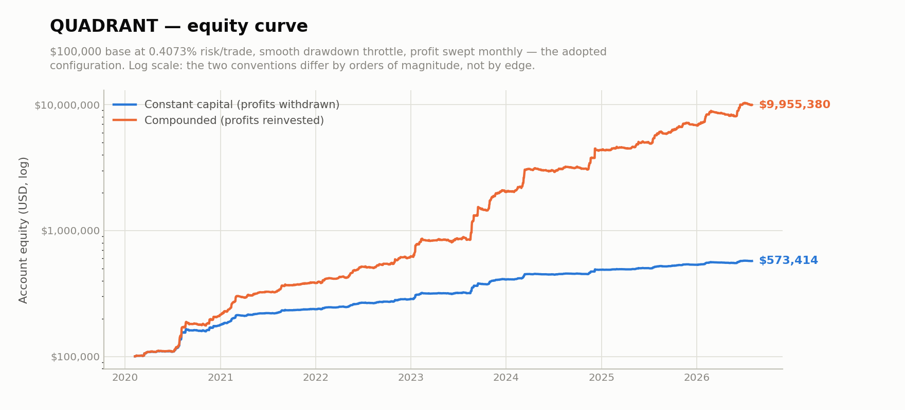
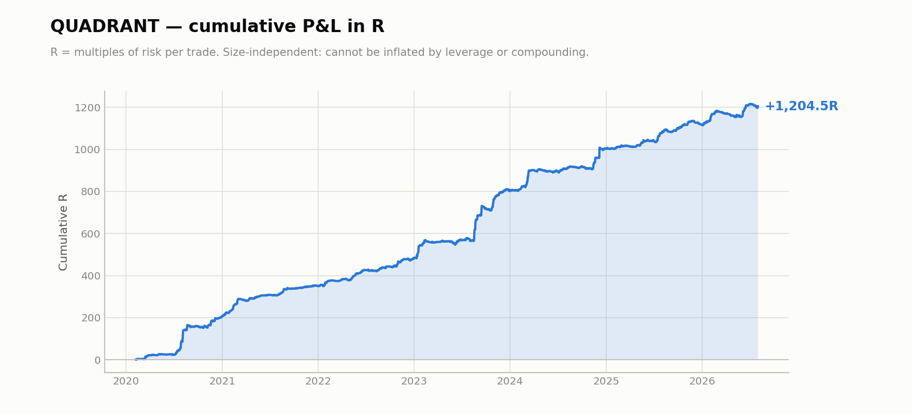
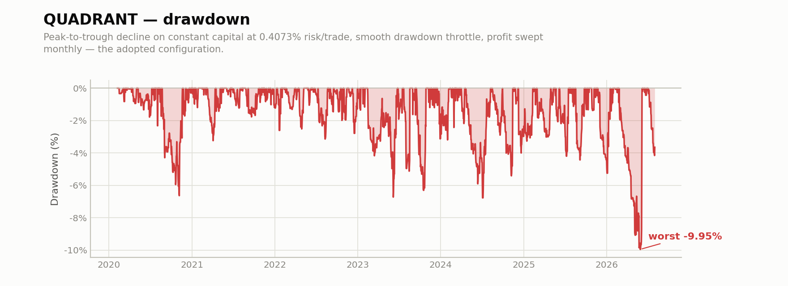
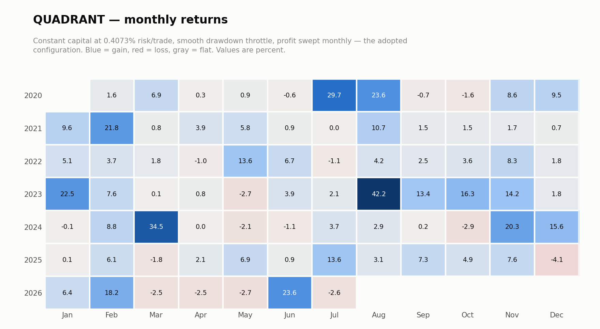

# QUADRANT

Cross-sectional multi-horizon crypto trend. Named for the four parallel holding
horizons (3 / 7 / 14 / 30 days) run simultaneously at quarter risk each — which is
what lifts Sharpe from 1.95 to 3.49.

```bash
python ../verify.py daily_returns.csv
```

## ⭐ 6.07% per month at a −9.95% maximum drawdown

That is the headline: **6.07% average monthly return** on a $100,000 account, against a
worst-ever drawdown of **−9.95%** — a MAR of **7.35** over 6.48 years and 78 months.

| metric | value |
|---|---|
| **return / month (mean)** | **6.07%** |
| return / month (median) | 3.00% |
| **return / year** | **73.1%** |
| total profit withdrawn | **$473,414** on a $100,000 base |
| **max drawdown** | **−9.95%** ($9,947) |
| **MAR (Calmar)** | **7.35** |
| Sharpe | 3.58 |
| months positive | 79% (62/78) |
| best month | +42.20% |
| worst month | −4.08% |
| risk per trade | 0.4073% |

**Every number here is reproducible from `daily_returns.csv`.** Monthly return is
literally the monthly sum of the published `pnl_usd` column divided by the $100,000
base — run `python ../verify.py daily_returns.csv` and it prints the table above. There
is no model to take on trust.

This is the **adopted configuration**: 0.4073% risk per trade, smooth drawdown throttle
(scale 0.05, floor 0.10), profit swept monthly to a constant $100,000 base, and full
real costs — maker 1.2 + taker 4.0 + entry slip 1.0 + stop slip 2.0 bps, plus signed
hourly funding from real 8-hour data. **The 6.07% is net of all of it.**

**Mean vs median: 6.07% vs 3.00%.** The distribution is strongly right-skewed — the best
month made +42.20%, the median +3.00%. The mean is the correct figure for expectancy and
compounding; the median describes a typical month. Both are published because quoting
only the mean would flatter the strategy, and any reader can compute the median from the
data in one line anyway.

**On drawdown**: −10% is where the *historical* worst drawdown sits by construction of
the sizing. The realistic planning figure is worse — bootstrap p5 is ~−11.4%, and
roughly −12.8% once execution lag is included. Size against those, not against −10%.

Quote constant-capital returns. Compounded figures are a sizing artifact, not evidence
of a better strategy.









Full month-by-month figures: **[MONTHLY.md](MONTHLY.md)**

## Design

| | |
|---|---|
| Universe | top 8 USDT perps by dollar volume, **selected point-in-time** |
| Signal | cross-sectional trend rank, market-neutral (long top / short bottom) |
| Horizons | 3d / 14d / 7d / 30d, quarter risk each |
| Median hold | ~71 hours |
| Long / short | 53% / 47% |
| Overlays | volatility targeting, correlation control, drawdown control |

Point-in-time universe selection matters more than it sounds. A fixed "top 8" list
chosen today is a lookahead trap — it silently excludes everything that died, so the
backtest only ever trades survivors. The universe here is rebuilt from the dollar volume
that was observable *at the time*.

## Results (2020-02 → 2026-07, 6.48 years)

| metric | value |
|---|---|
| Total R | **+1204.5** |
| R per year | +186.0 |
| Sharpe | **3.49** |
| Sortino | 9.49 |
| Max drawdown | −30.6 R |
| MAR | 6.07 |
| Days positive | 41.8% |

### Year by year — positive in all seven, including 2022

| year | R | Sharpe | max DD (R) |
|---|---:|---:|---:|
| 2020 | +206.6 | 4.03 | −14.4 |
| 2021 | +144.1 | 5.01 | −10.0 |
| 2022 | +134.6 | 4.40 | −8.8 |
| 2023 | +317.0 | 3.91 | −22.2 |
| 2024 | +200.5 | 3.04 | −16.3 |
| 2025 | +114.3 | 3.10 | −18.8 |
| 2026 (7mo) | +87.5 | 3.12 | −30.6 |

2022 is the year worth looking at: a market-neutral book that made +134.6R at Sharpe
4.40 through the worst crypto bear on record. The book is structurally market-neutral,
not directionally lucky.

### Development split (pre-registered)

| window | R | Sharpe | days |
|---|---:|---:|---:|
| early (< 2023-07) | +567.2 | 3.89 | 1239 |
| recent (≥ 2023-07) | +637.3 | 3.29 | 1127 |

## Out-of-sample evidence

The whole 2020–2026 window is where the parameters were chosen, so it is **all
in-sample** and reported as such. Real OOS evidence comes from three directions the
fitting never touched:

| test | scope | Sharpe | result |
|---|---|---:|---|
| **cross-sectional** | ranks 9–16 — never fitted to | **3.36** | retains ~80% of edge |
| cross-sectional | ranks 17–24 | 2.53 | decays smoothly, as theory predicts |
| **pre-sample** | 2018-07 → 2019-12 spot | **4.61** | before the test window opens |
| pre-sample @ 20bps | robustness | 4.44 | survives cost stress |
| forward | 2026-07, one month | — | −2.57% (see below) |

Cross-sectional validation is the strongest evidence here. If the parameters were fitted
to the top 8, they should fail on ranks 9–16. They don't — the edge decays gracefully
with liquidity rank, which is what a real cross-sectional effect looks like and what an
overfit one does not.

**On the forward month.** The single forward month on record (2026-07, 113 trades)
returned −2.57%. It is listed for completeness, but it carries almost no information
either way: one month out of a 77-month record is far too short a window to distinguish
edge from noise, and a strategy taking ~100 trades a month needs quarters, not weeks,
before forward data means anything.

More usefully, it is unremarkable *within* the strategy's own distribution. **19% of
in-sample months were negative** (62 of 77 positive), and the worst in-sample month was
**−4.09%** — worse than this one. A −2.57% month is an ordinary draw from a record that
already contains fifteen negative months, not a break in behaviour. It would take a
sustained run of months outside the historical distribution to indicate decay, and that
is the standard this should be held to as the forward record grows.

## Cost sensitivity — see `cost_scenarios.csv`

| scenario | MAR | Sharpe | max DD | ret/mo |
|---|---:|---:|---:|---:|
| maker entry, 8.2bps + funding | 8.41 | 3.57 | −8.5% | 4.82% |
| **taker both sides, 11.0bps + funding** | **8.17** | 3.53 | −8.6% | 4.77% |
| + 2× funding premium | 8.23 | 3.53 | −8.4% | 4.72% |
| **user model + 1h fill lag** | **3.20** | 2.46 | −13.7% | 3.30% |
| taker both + 2× funding + 1h lag | 2.96 | 2.37 | −13.9% | 3.14% |

Note these scenarios run at their own drawdown levels (−8.4% to −13.9%), **not** at the
−10% cap used in the sizing section. Compare them by MAR, which is risk-normalised;
comparing their `ret/mo` against the 6.07% headline is apples to oranges.

Flat-bps ladder: **30bps → MAR 6.47 · 50bps → 5.01 · 75bps → 3.68 · 100bps → 2.71.**

**The finding that matters: fees are nearly irrelevant, latency is not.** Doubling
execution cost moves MAR from 8.41 to 8.17. Adding a one-hour fill delay takes it to
3.20 — a 62% loss. Execution discipline is the binding live constraint, and later fills
cost roughly 4× more than missed ones, so the correct live behaviour is to skip a
trade rather than chase it.
