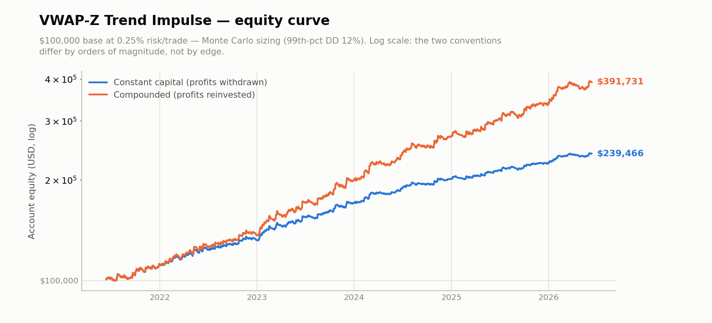
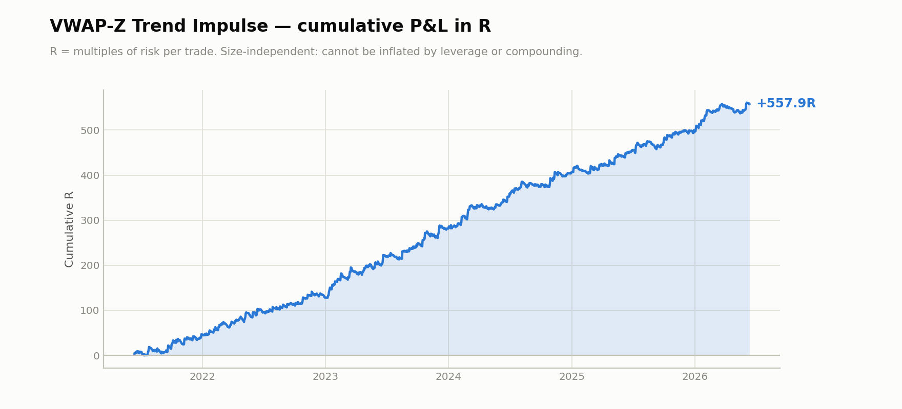
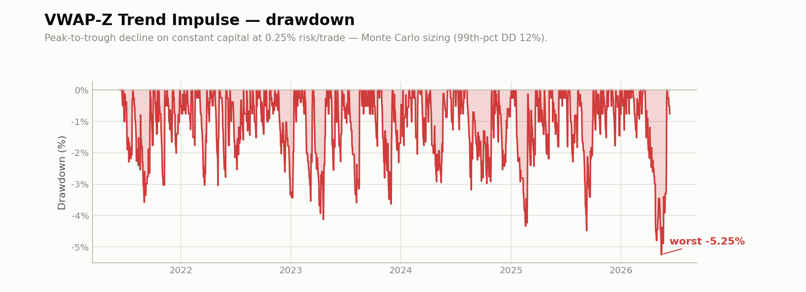
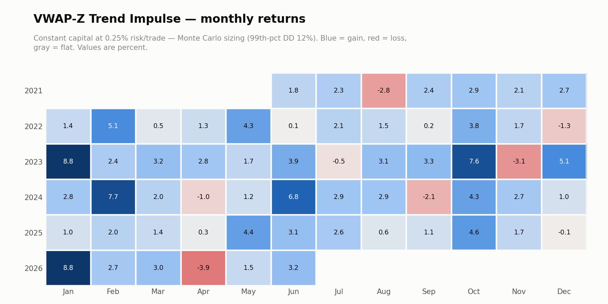

# VWAP-Z Trend Impulse

Single-asset 1-hour momentum on BTC perp. Low win rate, high payoff — ~30% of trades
win at a 3.5R target. Locked configuration, frozen 2026-06-16.

```bash
python ../verify.py daily_returns.csv
python ../verify.py daily_returns_eth.csv
```









Full month-by-month figures: **[MONTHLY.md](MONTHLY.md)**

## Results (2021-06 → 2026-06, 5.00 years, 1,741 trades)

| metric | value |
|---|---|
| Total R | **+557.9** |
| R per year | +111.6 |
| Avg R per trade | +0.320 |
| Win rate | 29.9% |
| Sharpe | 2.59 |
| Sortino | 9.22 |
| Max drawdown | −21.0 R |
| MAR | 5.32 |
| Median hold | 8.5 hours |

A 29.9% win rate is the design, not a defect. At a 3.5R target, breakeven is ~22% —
the strategy runs with meaningful headroom above it. But it means **long losing streaks
are normal** and the equity curve is jagged. Only 20.4% of days are positive.

### Year by year — positive in all six

| year | R | Sharpe | max DD (R) |
|---|---:|---:|---:|
| 2021 (7mo) | +45.5 | 1.96 | −14.3 |
| 2022 | +82.5 | 2.12 | −13.4 |
| 2023 | +153.2 | 3.10 | −16.5 |
| 2024 | +124.9 | 2.93 | −12.7 |
| 2025 | +90.4 | 2.15 | −17.9 |
| 2026 (6mo) | +61.4 | 3.28 | −21.0 |

### Sample split

| sample | R | Sharpe | days |
|---|---:|---:|---:|
| IS (< 2023-01) | +128.0 | 2.06 | 567 |
| **OOS (≥ 2023-01)** | **+429.9** | **2.81** | 1259 |

OOS outperforming IS is not evidence of a *better* strategy out of sample — it mostly
reflects that 2023–2025 were more favourable years. It is, however, evidence the edge
did not evaporate the moment fitting stopped.

## Cost sensitivity — see `cost_ladder.csv`

The single most important table here. Slippage is per fill; round trip includes the
1bps fee (0.5bps per side).

| slip/fill | round trip | total R | avg R | win rate |
|---:|---:|---:|---:|---:|
| 0 bps | 1 bps | +557.9 | +0.320 | 29.9% |
| 1 bps | 3 bps | +502.8 | +0.288 | 29.5% |
| 2 bps | 5 bps | +440.4 | +0.252 | 29.0% |
| 3 bps | 7 bps | +376.0 | +0.214 | 28.5% |
| 5 bps | **11 bps** | +258.9 | +0.146 | 27.7% |
| 8 bps | 17 bps | +75.2 | +0.042 | 26.3% |

**Breakeven is ~19–20 bps round trip. Realistic BTC perp taker cost is ~11 bps.**
The strategy clears its cost floor with roughly 2× margin — but that margin is the
whole story, and anyone quoting the 1bps number is quoting a fantasy. At 30 bps round
trip, an assumption appropriate for illiquid alts, this strategy is **negative**. It
works because BTC is liquid, and it does not generalise to instruments that aren't.

**Funding is immaterial**: −18.5R even at 22%/yr, because the median hold is 8.5 hours
and rarely spans many funding intervals.

## Out-of-sample and robustness

| test | result |
|---|---|
| **Walk-forward** (4 anchored folds, target re-picked on train) | **+364.6R**, every fold positive |
| **ETH, config unchanged** | **+252.0R**, Sharpe 1.91 over 2.95y |
| Remove top 50 winners | still +383.2R |
| Parameter neighbourhood | flat — no knife edge |

**The ETH transfer is the strongest result here.** The configuration was developed on
BTC and applied to ETH without changing a single parameter. It cannot be BTC-specific
curve-fitting and still do that.

ETH by year: **2023 −25.4R · 2024 +125.9R · 2025 +109.2R · 2026 +42.3R.** The first
year was negative — the transfer is real but not uniform.

Parameter robustness (total R across the neighbourhood):

```
z_entry         0.3:+568R   0.4:+558R   0.5:+548R
atr_stop_mult   0.8:+365R   1.0:+558R   1.2:+464R
time_stop_bars   72:+566R    96:+558R   120:+560R
final_target_r  3.0:+493R   3.5:+558R   4.0:+555R
```

Flat in every direction except `atr_stop_mult`, where the locked value sits on a
genuine local peak. That one deserves suspicion.

## Sizing — read this before any percentage figure

Monte Carlo over 10,000 trade-order reshuffles:

| risk / trade | 99th-percentile drawdown |
|---|---|
| 1.00% | **47.9% of equity** |
| 0.50% | 23.9% |
| 0.25% | **12.0%** |

Historical max drawdown was −21.0R; the reshuffled median is −27.0R and the 95th
percentile −40.1R. **The backtest drawdown is optimistic — it is one draw from this
distribution.** Size against the 99th percentile, which means ~0.25% risk per trade.

Compounded headline figures elsewhere in my notes (e.g. +4865%) assume 1% risk, which
this table shows is not a survivable sizing. **+558R is the honest number.**

## Limitations

- **The walk-forward only re-selects `final_target_r`**, not the entry parameters
  (`z_entry`, RSI bounds, the 20:00 UTC exclusion). It is a partial walk-forward and
  should be read as weaker evidence than a full one.
- **The 20:00 UTC entry exclusion is fitted on 59 trades.** The economic rationale —
  thin late-US/pre-Asia liquidity — is the real justification; the 2.4-point drawdown
  improvement is not statistically meaningful on that sample.
- **One asset, one cycle.** Five years of BTC is roughly one and a half cycles.
- **Low win rate demands discipline.** 70% of trades lose. Psychologically this is much
  harder to trade than the Sharpe suggests.
- Backtested fills. Entry is modelled at next-bar open; the delay sensitivity above is
  a proxy for, not a measurement of, real execution.
